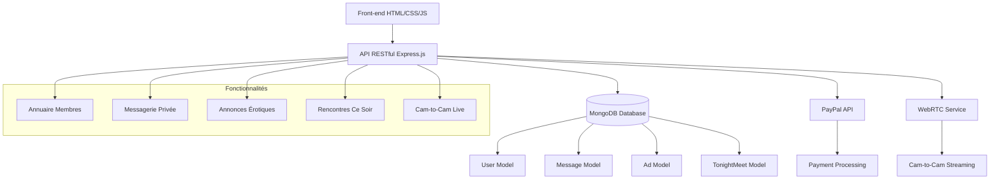

# Synthèse du Plan HotMeet - Architecture Complète

## ✅ Travail Accompli

### 1. Analyse des Spécifications
- Examen détaillé des fonctionnalités demandées
- Compréhension des besoins techniques et fonctionnels
- Identification des contraintes (hébergement Infomaniak, PayPal, etc.)

### 2. Architecture Technique Définie
- **Stack** : Express.js + MongoDB + JWT
- **Front-end** : HTML5/CSS3/JavaScript vanilla
- **Paiements** : PayPal API + préparation Segpay
- **WebRTC** : Pour fonctionnalité cam-to-cam

### 3. Structure des Dossiers Créée
- Organisation modulaire front-end/back-end
- Séparation claire des responsabilités
- Structure optimisée pour le déploiement Infomaniak

### 4. Modèles de Données Détaillés
- **User** : Profil utilisateur complet avec préférences
- **Message** : Système de messagerie avec provenance
- **Ad** : Annonces érotiques avec critères
- **TonightMeet** : Rencontres "Ce soir" avec réponses

### 5. API RESTful Documentée
- 20+ endpoints couvrant toutes les fonctionnalités
- Authentification JWT sécurisée
- Gestion d'erreurs standardisée
- Documentation complète avec exemples

## 📋 Prochaines Étapes d'Implémentation

### Phase 1: Configuration de Base
1. Créer les fichiers de configuration (.env, package.json)
2. Initialiser la structure des dossiers
3. Configurer la base de données MongoDB

### Phase 2: Back-end Core
4. Implémenter les modèles MongoDB
5. Développer l'authentification JWT
6. Créer les contrôleurs et routes API

### Phase 3: Front-end Principal
7. Créer les pages HTML avec design responsive
8. Développer les styles CSS modernes et élégants
9. Implémenter la logique JavaScript

### Phase 4: Fonctionnalités Spécifiques
10. Système d'annuaire avec filtres avancés
11. Messagerie privée avec provenance
12. Annonces érotiques (premium uniquement)
13. Rencontres "Ce soir" avec système d'avis
14. Intégration cam-to-cam WebRTC

### Phase 5: Système Premium
15. Intégration PayPal (5.75 CHF/mois)
16. Logique d'abonnement automatique
17. Gratuité pour femmes vérifiées

### Phase 6: Finalisation
18. Génération profils de démonstration réalistes
19. Optimisation SEO complète
20. Tests et déploiement Infomaniak

## 🔧 Points Techniques Clés

### Sécurité Renforcée
- Vérification âge 18+ obligatoire
- Hashage mots de passe (bcrypt)
- Validation JWT pour routes protégées
- Sanitisation des entrées utilisateur

### Performance Optimisée
- Indexes MongoDB pour requêtes rapides
- Pagination sur les listes
- Cache des données fréquemment consultées

### SEO Avancé
- Meta tags optimisés par page
- Structure H1-H3 sémantique
- Sitemap XML généré dynamiquement
- URLs propres et descriptives

## 📊 Diagramme d'Architecture

## ⏱️ Estimation de Temps de Développement

- **Configuration base** : 2-3 jours
- **Back-end core** : 5-7 jours  
- **Front-end principal** : 7-10 jours
- **Fonctionnalités avancées** : 10-14 jours
- **Tests et optimisation** : 3-5 jours
- **Total estimé** : 4-6 semaines

## 🚀 Prêt pour l'Implémentation

L'architecture est maintenant complètement définie avec :
- ✅ Structure technique validée
- ✅ Modèles de données détaillés
- ✅ API RESTful documentée
- ✅ Plan de déploiement Infomaniak
- ✅ Stratégie SEO complète

**Le projet est prêt pour le passage en mode Code pour l'implémentation.**

## ❓ Validation Requise

Avant de procéder à l'implémentation, veuillez confirmer que ce plan répond à vos attentes ou si des modifications sont nécessaires.